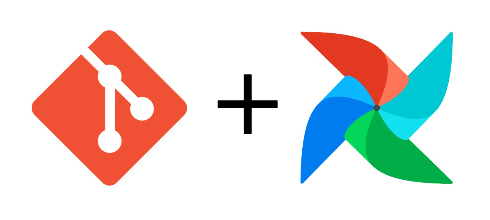
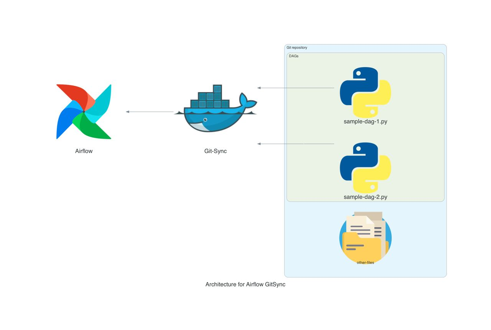

# Airflow Git Sync
🎉 What if you could instantly sync DAG changes from **Git** to **Airflow**? Well now you can!

<p align=center>
    <!-- TODO:// For each repository we MUST use local images  -->
    
</p>

<!-- TODO:// Add more badges to the sample template -->
<p align=center>
    <a href="https://github.com/data-burst/airflow-git-sync/graphs/contributors">
    
    </a>
    <a href="https://github.com/data-burst/airflow-git-sync/LICENSE"> 
    
</a>
</p>

## Table of Contents🏗️

- [Airflow Git Sync](#airflow-git-sync)
  - [Table of Contents🏗️](#table-of-contents️)
  - [Project Description 🌱](#project-description-)
  - [Project Usage 🧑‍💻](#project-usage-)
  - [Contributing 👥](#contributing-)
  - [License 📄](#license-)

## Project Description 🌱

Airflow Git Sync provides automated DAG deployments from Git for Airflow environments. It syncs your pipeline code from a Git repository into the Airflow DAG folder.

Keeping DAGs directly in Airflow servers makes management challenging. Code changes require manual syncing to containers. There is no version control or history.
If you have ever worked with Airflow on Kubernetes, it gives you the ability to sync the DAGs with your repository (as an GitOps solution) using `git-sync` contanier. If you don't have Kubernetes, it is hard to keep the DAGs directory of Airflow (which is placed at `/opt/airflow/dags/`) synced with the changes you applied to your DAGs and in some cases it is required to restart the Airflow service or container.

The project introduces `git-sync` application alongside Airflow. This handles cloning your configured DAG Git repository and syncing contents over to Airflow's DAG directory.

The syncing is achieved via a lightweight Docker container that runs periodically using inotify wait to detect file changes. The container can be deployed using docker-compose alongside Airflow. Here is a bit of the docker-compose file:

```bash
  airflow-webserver:
    # Airflow container

  airflow-scheduler:
    # Airflow container  
    
  git-sync:
    # Git-sync container
    image: databurst/airflow-git-sync:latest  
    environment:
      - REPO_URL: http://example.com/airflow-dags.git
      #...other config
```
The git-sync container will keep DAGs in Airflow containers continually synced from files committed to the Git repository.

The end result is Airflow DAGs can be managed via Git best practices. Changes are automatically reflected in your pipeline deployment. No need for complex Kubernetes just to get basic Git sync!

<p align=center>
    <!-- TODO:// For each repository we MUST use local images  -->
    
</p>

## Project Usage 🧑‍💻

Using Airflow Git Sync is simple:

1. Add the git-sync container to your docker-compose or Airflow deployment manifest.
2. Configure it via environment variables in `docker-compose.yaml` file:

    | Variable | Description | Default Value |
    | --- | --- | --- |
    | `REPO_URL` | The URL of the Git repository to sync | `N/A` (required) |
    | `GIT_URL` | The URL of the Git server | `github.com` |
    | `GIT_BRANCH` | The Git branch to sync | `main` |
    | `DIRECTORY_NAME` | The name of the directory to clone the repository into | `project` |
    | `DESTINATION_PATH` | The path to sync the repository to | `/app/sync` |
    | `INTERVAL` | The interval (in seconds) to sync the repository | `10` |

3. Manage your DAG files in Git as usual. Changes will be automatically synced to Airflow containers.
4. Trigger automated deployments by pushing DAG changes to your Git repo.

You can find the `docker-compose.sample.yaml` file to learn how to set your own variables in docker-compose.yaml file.
With just a few lines of configuration, you can revolutionize your Airflow DAG management. No adjustments needed to Airflow itself.

Also, you can rename `docker-compose.sample.yaml` to `docker-compose.yaml` and get our image `databurst/airflow-git-sync:latest` with the default values.

## Contributing 👥

We welcome contributions to this repository! If you’re interested in contributing, please take a look at our [CONTIRIBUTION.md](https://github.com/data-burst/airflow-git-sync/CONTRIBUTING.md) file for more information on how to get started. We look forward to collaborating with you!

## License 📄

This repository is licensed under the MIT License, which is a permissive open-source license that allows for reuse and modification of the code with few restrictions. You can find the full text of the license in [this](https://github.com/data-burst/airflow-git-sync/license) file.